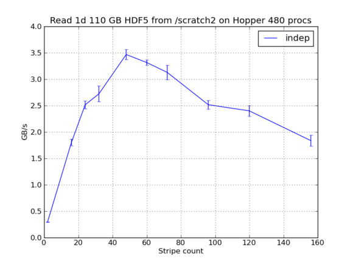

% Python for High Performance Computing
% Andrea Zonca, UCSB
% 13 Nov 2012

# Topics

* Trivially parallel tasks: IPython parallel
* Fully parallel software: PyTrilinos

# Trivially parallel tasks with IPython parallel

## Architecture:

* Submit function+arguments to a queue (managed by the `controller`) consumed by workers (engines)
* function is *serial*, no IPython-specific, easy debugging
* same function work serially, locally on multi-core, or on large cluster

# IPython parallel: Local example

open IPython notebook `ipythonparallel.ipynb`

## Tips

Launch `ipcluster` from same folder of the script so the engines have same path

Define the function in its own module, otherwise necessary to rewrite the import statements

# IPython parallel on a HPC cluster

* Launch `ipcontroller` on the login node
* Submit ipengine job to the queue management system (see documentation on how to build a pbs script)
* Open IPython on the login node and submit jobs
to the controller

# Example run for Planck

* 1.5TB of raw data in ~3000 FITS files
* read files, simple processing and rewrite to disk
* run IPython parallel with up to 500 engines
* process the jobs in ~3 hours

# Distributed Linear Algebra

Large complete C++ packages with Python support

* PETSC, petsc4py
* Trilinos, PyTrilinos

Both use C++ for MPI communication and LAPACK/BLAS for computing

Both subclass numpy arrays

# Trilinos example

`pytrilinos.ipynb`

export pytrilinos.py and run with mpirun -n 3 python pytrilinos.py

# Usage in Planck

Parallel MapMaking software, ~1TB of timelines to a sky map

Same MPI performance of highly optimized Fortran code tailored to the task

# Parallel I/O

Currently main missing feature in Python for HPC is support for Parallel I/O (`mpi4py` binary is not portable)

Best option would be HDF5: C and F90 libraries supported on XSEDE/NERSC clusters for Lustre and GPFS filesystems

Currently `h5py` and `pytables` do not support parallel HDF5

I have a C module (+cython) custom working module written for my datasets, to be generalized

# Performance at NERSC

    
